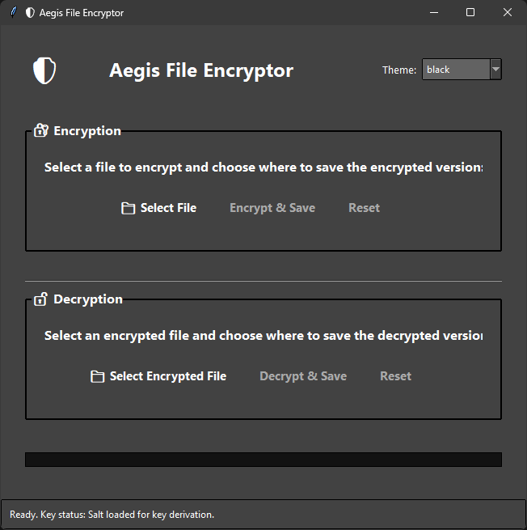

# Aegis File Encryptor

A modern, user-friendly GUI application for encrypting and decrypting files using Fernet symmetric encryption. Built with Python, Tkinter, and ttkthemes for a professional look.

**Repository**: [GitHub - QuantumPixelator/AegisFileEncryptor](https://github.com/QuantumPixelator/AegisFileEncryptor)

## Version

**v1.1** - Enhanced with file extension preservation, improved theming, and better user feedback.

## Features

- **Secure Encryption**: AES-128 encryption with HMAC integrity using the `cryptography` library
- **Password-Based Keys**: Encryption keys are derived from user-provided passwords using PBKDF2
- **File Extension Preservation**: Original file extensions are saved and restored automatically
- **Any File Type**: Supports encryption/decryption of images, documents, audio, video, and any other file type
- **Themeable Interface**: Multiple built-in themes with persistent theme selection
- **File Selection**: Browse and select files with native dialogs
- **Save Location Control**: Choose where to save encrypted/decrypted files with overwrite protection
- **Status Updates**: Real-time feedback on operations with success/error dialogs
- **Progress Tracking**: Visual progress bar for long operations
- **Secure Key Management**: Salt-based key derivation with user passwords

## Screenshots



## Requirements

- Python 3.7+
- Dependencies listed in `requirements.txt`

## Installation

1. Clone or download the repository
2. Create a virtual environment (recommended):
   ```bash
   python -m venv venv
   ```
3. Activate the virtual environment:
   - Windows: `venv\Scripts\activate`
   - Linux/Mac: `source venv/bin/activate`
4. Install dependencies:
   ```bash
   pip install -r requirements.txt
   ```

## Usage

1. Run the application:
   ```bash
   python main.py
   ```

2. **Encryption**:
   - Click "Select File" in the Encryption section
   - Choose any file to encrypt
   - Click "Encrypt & Save"
   - Enter a password when prompted (remember this password!)
   - Choose where to save the encrypted `.enc` file

3. **Decryption**:
   - Click "Select Encrypted File" in the Decryption section
   - Choose a `.enc` file
   - Click "Decrypt & Save"
   - Enter the same password used for encryption
   - Choose where to save the decrypted file (original extension will be suggested)

4. **Themes**: Use the dropdown in the top-right to switch themes instantly. Your selection is saved automatically.

## Security Notes

- Uses Fernet (AES-128 + HMAC) for strong, authenticated encryption
- Keys are derived from user passwords using PBKDF2 with a stored salt
- Salt is stored locally in `secret.key` (this file contains only the salt, not the actual key)
- **Remember your passwords!** Without the correct password, files cannot be decrypted
- **WARNING**: Use strong, unique passwords for encryption. The salt file should be kept secure.
- Never share encrypted files without sharing the password securely
- For high-security needs, consider additional measures like key rotation and secure password management

## File Structure

```
.
├── main.py                 # Main application
├── requirements.txt        # Python dependencies
├── secret.key              # Salt for key derivation (generated automatically)
├── theme_config.txt        # Theme preference (generated automatically)
├── screenshot.png          # App screenshot
├── README.md               # This file
└── venv/                   # Virtual environment (optional)
```

## Troubleshooting

- **"Encryption service not initialized"**: Check file permissions for `secret.key`
- **Wrong password**: If decryption fails, ensure you're using the correct password
- **Large files**: May take time to process; ensure sufficient RAM and disk space
- **Theme issues**: Some themes may not display perfectly on all systems
- **Dialog positioning**: Password and success dialogs should center on the main window
- **File extension not restored**: Ensure the encrypted file was created with this version of the app

## License

This project is open-source. Use at your own risk.

## Contributing

Feel free to submit issues or pull requests for improvements.